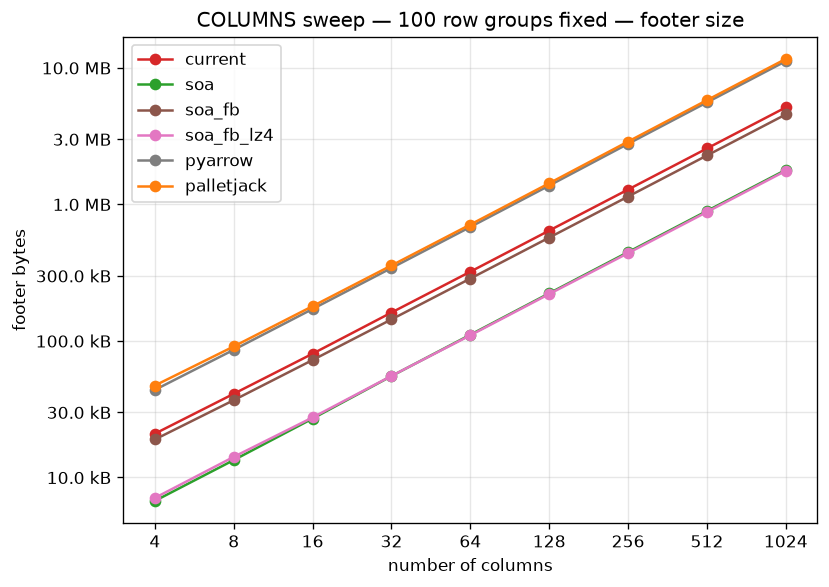
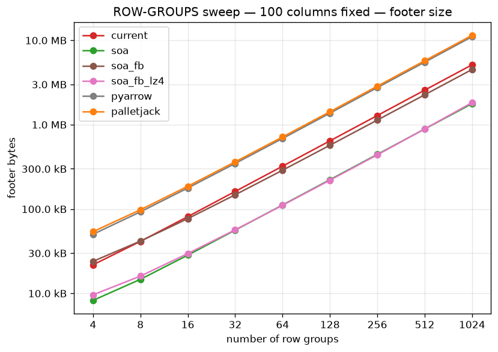

### Previous versions:
- [v2026-08](https://github.com/marcin-krystianc/ParquetFooterPlayground/tree/v2026-08)

# Parquet footer benchmarks (2026)

Parquet ([file format docs](https://parquet.apache.org/docs/file-format/)) stores its metadata
footer as a nested array of Thrift structs, which forces a reader to decode the whole footer even
when it only wants the byte offsets of a few columns. This benchmark measures the read cost of
alternative footer layouts and encodings, as input to designing a new footer format. Read cost is
the time to obtain `data_page_offset` and `total_compressed_size` for a projected subset of
columns.

Two sweeps compare footer encodings: `current`, `soa`, and three FlatBuffers SoA
variants (`soa_fb`, `soa_fb_lz4`, `soa_fb_lz4_verified`). One sweep varies the number of columns,
the other the number of row groups. Both also measure a second category, FileMetaData producers,
over a real Parquet file: `pyarrow`, which parses the whole footer with no projection, and
G-Research PalletJack, which reads only the projected row groups and columns through an index.

The FlatBuffers SoA footer is read by a native C++ reader (`native_build/shim.cpp`) via three
angles: soa_fb (uncompressed, unverified), soa_fb_lz4 (LZ4_FRAME-compressed via the pyarrow
codec, decompressed in C++ with liblz4), and soa_fb_lz4_verified (adds the generated
FlatBuffers verifier before the scan). soa_fb_lz4 vs soa_fb isolates the compression cost;
soa_fb_lz4_verified vs soa_fb_lz4 isolates the verification cost. The Python flatbuffers
package + flatc `--python` accessors (`flatbuffers_gen/`) are used only to BUILD the footer;
flatc `--cpp` generates the reader's header at build time.

## Setup
Build the native extension once before running:

```bash
python setup.py build_ext --inplace
```

That requires the thrift compiler, libthrift, a C++ compiler, Cython, and (for flatbuffers)
flatc + libflatbuffers-dev + liblz4-dev, plus the flatbuffers package.

Every run recomputes all timings from scratch. Run as a script to render the plots and tables:

```bash
python parquet_footer_benchmarks_2026.py
```

PS (Ubuntu + uv):

```bash
apt-get install libflatbuffers-dev liblz4-dev thrift-compiler libthrift-dev g++
uv sync
uv run --with setuptools --with wheel --with cython python setup.py build_ext --inplace
uv run python parquet_footer_benchmarks_2026.py
```

## Formats explained

A Parquet footer stores, per column chunk, where that chunk's data lives (data_page_offset)
and how big it is (total_compressed_size), plus type/encoding/row-count bookkeeping. A
"projected" read wants those fields for only a subset of columns. The formats below differ in
how the footer is laid out and therefore in how cheaply a projected read can reach just the
wanted chunks.

- current — the layout Parquet uses today. Nested array-of-structs: FileMetaData -> row groups ->
  columns -> one `ColumnMetaData` struct per chunk, serialized with Thrift's compact protocol.
  The protocol is linear, so to read any column you must decode every field of every chunk from
  the front. Cost grows with the whole footer, not with how many columns you asked for.

- soa (struct-of-arrays) — instead of one struct per chunk, store one parallel array per field
  across all chunks: all data_page_offsets together, all total_compressed_sizes together, and so
  on. Still Thrift compact and still decoded whole, but dropping the repeated per-chunk field
  tags makes it markedly smaller and faster to decode than "current".

- soa_fb — the same struct-of-arrays layout encoded with FlatBuffers instead of Thrift.
  FlatBuffers stores fixed-width vectors that are addressable in place: there is no decode pass,
  the reader points at the buffer and indexes the two vectors it needs at the selected chunk
  positions. This variant is uncompressed and trusted (the buffer is read without validation).

- soa_fb_lz4 — the soa_fb footer compressed with LZ4_FRAME. Smaller on disk, but LZ4_FRAME is not
  random-access, so the reader must decompress the whole footer into memory before the in-place
  scan. Isolates the size/speed cost of compression versus soa_fb.

- soa_fb_lz4_verified — soa_fb_lz4 plus a run of the generated FlatBuffers verifier
  (bounds/offset checks over the buffer) before reading. This is the safe way to read a buffer
  from an untrusted source; the gap to soa_fb_lz4 is what that safety costs.

- pyarrow — the un-accelerated baseline. Parse the entire real Parquet footer with Arrow and
  build a full FileMetaData object graph on every call, with no projection. This is what reading
  metadata costs today without any acceleration.

- palletjack — G-Research PalletJack. A one-time sidecar index built over a real Parquet file's
  metadata. Read fetches only the selected row groups/columns through the index instead of
  parsing the whole footer, so it accelerates the pyarrow baseline and converges to it as the
  projection approaches 100%.

### current vs soa layout

Note, that these diagrams show only the placement-info fields this benchmark reads.
See `footer-core-current.thrift` and `footer-core-soa.thrift` for the full
field lists.

- `current` is array-of-structs: one `ColumnMetaData` struct per chunk, each carrying its own
copy of every field.

```text
FileMetaData
|
+-- row_groups[0]
|     +-- columns[0].meta_data -> ColumnMetaData { type, encodings, path_in_schema, codec,
|     |                             num_values, total_uncompressed_size,
|     |                             total_compressed_size, data_page_offset, ... }
|     +-- columns[1].meta_data -> ColumnMetaData { same fields, own copy }
|     +-- columns[N].meta_data -> ColumnMetaData { same fields, own copy }
|
+-- row_groups[1]
|     +-- columns[0].meta_data -> ColumnMetaData { ... }
|     +-- columns[1].meta_data -> ColumnMetaData { ... }
|     +-- columns[N].meta_data -> ColumnMetaData { ... }
|
+-- row_groups[G] ...
```

- `soa` is struct-of-arrays: one parallel array per field, shared across all chunks. Chunks are
column-major, index `c * num_row_groups + g` (`ColumnChunkMatrix`, `footer-core-soa.thrift`).

```text
FileMetaData
|
+-- row_groups: RowGroupMatrix
|     num_rows            [ g0, g1, g2, ... gG ]            one i64 per row group
|
+-- chunks: ColumnChunkMatrix        index = c * num_row_groups + g
      data_page_offsets         [ chunk0, chunk1, chunk2, ... chunkN ]
      dictionary_page_offsets   [ chunk0, chunk1, chunk2, ... chunkN ]
      total_compressed_sizes    [ chunk0, chunk1, chunk2, ... chunkN ]
      total_uncompressed_sizes  [ chunk0, chunk1, chunk2, ... chunkN ]
      num_values                [ chunk0, chunk1, chunk2, ... chunkN ]
      codecs                    [ chunk0, chunk1, chunk2, ... chunkN ]
```

## Reading these tables

Values are `read_ms`: fastest wall-clock milliseconds over REPEATS runs. Note that the two categories
are NOT directly comparable to each other:

A) **Offset/size scanners** - decode the footer and SUM `data_page_offset` +
   `total_compressed_size` over the projected columns (return three integers):
- current — native Thrift C++ — decodes the WHOLE footer (compact protocol is linear)
- soa — native Thrift C++ — decodes the whole struct-of-arrays footer
- soa_fb — native FlatBuffers C++ — reads the uncompressed SoA footer directly and sums the
             two chunk vectors over the selected columns. Buffer is trusted (no verification).
- soa_fb_lz4 — same, but the footer is LZ4_FRAME-compressed; the reader decompresses the whole
             footer (C++ liblz4) before the scan.
- soa_fb_lz4_verified — same as soa_fb_lz4, but runs the generated FlatBuffers verifier
             (`VerifyFileMetaDataBuffer`) before the scan.

B) **FileMetaData producers** - return a full pyarrow `FileMetaData` object graph (one
   ColumnChunkMetaData per selected chunk); much heavier per chunk than a sum:
- pyarrow — baseline — parses the WHOLE real Parquet footer every call (no projection),
             so `read_ms` is flat across projection_pct. This is the un-accelerated cost.
- palletjack — reads metadata for ONLY the selected row groups +
             columns via its index, so it accelerates the pyarrow baseline and converges
             to it as projection -> 100%. (columns / row-groups sweeps only.)

Each sweep prints two tables: `read_ms` (by projection) and `footer_bytes`, plus a chart for
each. The `footer_bytes` is the serialized footer size each producer emits (independent of
projection). It is a size-on-disk metric, not necessarily the bytes touched by a projected read.


## COLUMNS sweep — 100 row groups fixed


**read_ms**

```text
format                           current    soa  soa_fb  soa_fb_lz4  soa_fb_lz4_verified  pyarrow  palletjack
projection_pct n_columns chunks                                                                              
10             4         400       0.124  0.014   0.000       0.006                0.006    0.188       0.053
               8         800       0.249  0.026   0.000       0.011                0.011    0.368       0.054
               16        1600      0.474  0.050   0.000       0.020                0.020    0.755       0.102
               32        3200      0.952  0.098   0.000       0.039                0.039    1.468       0.142
               64        6400      1.822  0.193   0.001       0.061                0.064    2.680       0.265
               128       12800     3.937  0.392   0.001       0.099                0.098    5.828       0.670
               256       25600     7.116  0.757   0.002       0.195                0.195   10.459       1.175
               512       51200    13.839  1.525   0.003       0.400                0.402   21.464       2.192
               1024      102400   32.390  3.250   0.006       0.873                0.826   46.358       5.071
50             4         400       0.125  0.014   0.000       0.006                0.006    0.191       0.104
               8         800       0.242  0.029   0.001       0.012                0.011    0.365       0.185
               16        1600      0.476  0.050   0.001       0.020                0.021    0.783       0.352
               32        3200      0.939  0.098   0.001       0.039                0.039    1.455       0.721
               64        6400      1.790  0.191   0.002       0.064                0.064    2.723       1.375
               128       12800     3.803  0.415   0.003       0.106                0.106    6.036       2.846
               256       25600     6.937  0.765   0.006       0.198                0.199   10.708       5.236
               512       51200    13.831  1.532   0.012       0.408                0.410   21.850      10.855
               1024      102400   29.730  3.381   0.026       0.867                0.859   46.057      23.312
90             4         400       0.133  0.017   0.001       0.007                0.007    0.193       0.186
               8         800       0.245  0.026   0.001       0.011                0.011    0.368       0.309
               16        1600      0.474  0.049   0.001       0.022                0.021    0.777       0.636
               32        3200      0.934  0.097   0.002       0.039                0.039    1.396       1.253
               64        6400      1.830  0.192   0.003       0.065                0.062    2.694       2.637
               128       12800     3.679  0.392   0.005       0.102                0.102    5.330       4.780
               256       25600     6.888  0.775   0.010       0.202                0.205   10.950       9.685
               512       51200    13.988  1.548   0.020       0.428                0.433   23.507      21.309
               1024      102400   28.474  3.226   0.044       0.830                0.833   44.980      39.738
```

**footer_bytes**



```text
format             current       soa    soa_fb soa_fb_lz4 soa_fb_lz4_verified   pyarrow palletjack
n_columns chunks                                                                                  
4         400      20.9 kB    6.7 kB   19.0 kB     7.1 kB              7.1 kB   43.8 kB    47.1 kB
8         800      41.0 kB   13.4 kB   36.8 kB    14.1 kB             14.1 kB   86.1 kB    91.1 kB
16        1600     80.6 kB   27.0 kB   72.5 kB    27.5 kB             27.5 kB  171.4 kB   179.8 kB
32        3200    161.5 kB   55.3 kB  143.9 kB    55.4 kB             55.4 kB  342.3 kB   357.4 kB
64        6400    321.7 kB  111.0 kB  286.6 kB   110.0 kB            110.0 kB  683.9 kB   712.5 kB
128       12800   643.8 kB  223.4 kB  572.0 kB   220.7 kB            220.7 kB    1.4 MB     1.4 MB
256       25600     1.3 MB  447.4 kB    1.1 MB   439.8 kB            439.8 kB    2.8 MB     2.9 MB
512       51200     2.6 MB  896.1 kB    2.3 MB   881.0 kB            881.0 kB    5.6 MB     5.8 MB
1024      102400    5.1 MB    1.8 MB    4.6 MB     1.8 MB              1.8 MB   11.2 MB    11.7 MB
```

## ROW-GROUPS sweep — 100 columns fixed


**read_ms**

```text
format                              current    soa  soa_fb  soa_fb_lz4  soa_fb_lz4_verified  pyarrow  palletjack
projection_pct n_row_groups chunks                                                                              
10             4            400       0.126  0.023   0.000       0.006                0.007    0.353       0.031
               8            800       0.236  0.034   0.000       0.010                0.010    0.493       0.045
               16           1600      0.460  0.059   0.000       0.016                0.016    0.851       0.081
               32           3200      0.911  0.105   0.000       0.028                0.029    1.527       0.148
               64           6400      1.840  0.197   0.001       0.052                0.049    2.900       0.289
               128          12800     3.585  0.383   0.001       0.096                0.095    5.374       0.584
               256          25600     7.066  0.741   0.001       0.191                0.193   10.652       1.177
               512          51200    14.429  1.482   0.002       0.393                0.391   21.264       2.286
               1024         102400   28.547  3.034   0.004       0.811                0.813   43.070       4.563
50             4            400       0.128  0.025   0.000       0.007                0.007    0.336       0.135
               8            800       0.238  0.035   0.000       0.010                0.010    0.512       0.211
               16           1600      0.474  0.059   0.001       0.016                0.017    0.840       0.374
               32           3200      0.962  0.106   0.001       0.029                0.029    1.523       0.736
               64           6400      1.829  0.194   0.002       0.051                0.049    2.771       1.391
               128          12800     3.574  0.385   0.003       0.100                0.101    5.404       2.655
               256          25600     6.952  0.747   0.005       0.195                0.195   10.617       5.384
               512          51200    14.201  1.549   0.010       0.409                0.399   21.601      10.778
               1024         102400   28.997  2.986   0.019       0.824                0.821   43.772      22.573
90             4            400       0.136  0.025   0.001       0.007                0.007    0.339       0.213
               8            800       0.256  0.035   0.001       0.010                0.011    0.512       0.359
               16           1600      0.459  0.059   0.001       0.016                0.016    0.820       0.694
               32           3200      0.921  0.114   0.001       0.031                0.032    1.471       1.254
               64           6400      1.819  0.199   0.002       0.053                0.054    2.830       2.419
               128          12800     3.552  0.383   0.005       0.098                0.099    5.259       4.726
               256          25600     7.150  0.766   0.010       0.205                0.200   10.773       9.812
               512          51200    14.507  1.937   0.019       0.461                0.456   21.685      19.162
               1024         102400   29.568  3.170   0.036       0.836                0.834   42.868      39.678
```

**footer_bytes**



```text
format                current       soa    soa_fb soa_fb_lz4 soa_fb_lz4_verified   pyarrow palletjack
n_row_groups chunks                                                                                  
4            400      21.8 kB    8.2 kB   24.0 kB     9.6 kB              9.6 kB   50.1 kB    53.9 kB
8            800      41.3 kB   14.7 kB   41.6 kB    16.0 kB             16.0 kB   92.6 kB    98.0 kB
16           1600     81.3 kB   28.4 kB   76.9 kB    29.6 kB             29.6 kB  177.4 kB   186.1 kB
32           3200    161.5 kB   56.1 kB  147.4 kB    56.7 kB             56.7 kB  347.2 kB   362.5 kB
64           6400    322.0 kB  111.7 kB  288.4 kB   110.8 kB            110.8 kB  686.6 kB   715.3 kB
128          12800   643.0 kB  222.7 kB  570.6 kB   219.6 kB            219.6 kB    1.4 MB     1.4 MB
256          25600     1.3 MB  444.8 kB    1.1 MB   438.7 kB            438.7 kB    2.8 MB     2.9 MB
512          51200     2.6 MB  888.9 kB    2.3 MB   890.6 kB            890.6 kB    5.5 MB     5.7 MB
1024         102400    5.1 MB    1.8 MB    4.5 MB     1.8 MB              1.8 MB   11.1 MB    11.5 MB
```


## Conclusions

Read speed:
- soa is faster than "current". The struct-of-arrays layout drops the nested
  `ColumnChunk`/`ColumnMetaData` framing and the per-chunk field tags that "current" repeats for
  every chunk. The Thrift compact decoder therefore parses far fewer fields for the same
  information.
- soa_fb is faster than soa. FlatBuffers needs no decode pass at all: "soa" runs the Thrift
  compact decoder over the entire footer (varint parsing + building vectors), while "soa_fb"
  casts the buffer and reads the two chunk vectors it needs directly. Its cost is O(selected
  chunks) rather than O(whole footer).
- soa_fb_lz4 is slower than soa_fb. The reader must decompress the entire footer before the 
  in-place scan. The gap (soa_fb_lz4 minus soa_fb) is the whole-footer decompression cost,
  and the read no longer scales with only the selected chunks. LZ4 decompression is
  about 4x faster than the Thrift compact decoder, so decompressing the whole footer here is
  still far cheaper than the full Thrift decode that "current" and "soa" pay.
- soa_fb_lz4_verified is about the same as soa_fb_lz4. The FlatBuffers verifier is a single
  bounds/offset-checking pass over the buffer (cheap integer comparisons) and is dwarfed by the
  decompress + scan already paid. Validating an untrusted buffer is nearly free here.

Footer size (`footer_bytes`):
- current is larger than soa. "current" keeps the nested framing plus duplicate/deprecated
  fields; "soa" stores the same information as parallel arrays with no per-chunk tags.
- soa_fb (uncompressed) is larger than soa (Thrift). FlatBuffers stores fixed-width 8-byte
  integers, whereas Thrift compact varint-encodes them, so the raw FlatBuffers footer is bigger.
- soa_fb_lz4 is close to soa (Thrift). LZ4-compressing the fixed-width FlatBuffers footer
  recovers most of what varint bought Thrift: per-value varint and block compression are two
  routes to the same compactness, so they land in the same neighborhood.
- current is much smaller than pyarrow as it is a reduced
  footer that omits statistics, key/value metadata, created_by, column_orders and page-index
  offsets, while pyarrow measures a real, full footer that carries all of them.

Decoder caveat:
- The current and soa readers use the generic Thrift compact decoder emitted by the
  Thrift compiler, which is not necessarily the most optimal Thrift parser; a hand-written decoder
  could do less per-field work. The current layout has the most headroom, since much of its cost is
  per-field dispatch across the nested per-chunk structs. For the soa layout the generic decoder is
  close to optimal: the struct-of-arrays collapses the footer into a few primitive arrays, so the
  decode is already little more than a varint scan with little per-field work left to remove.

